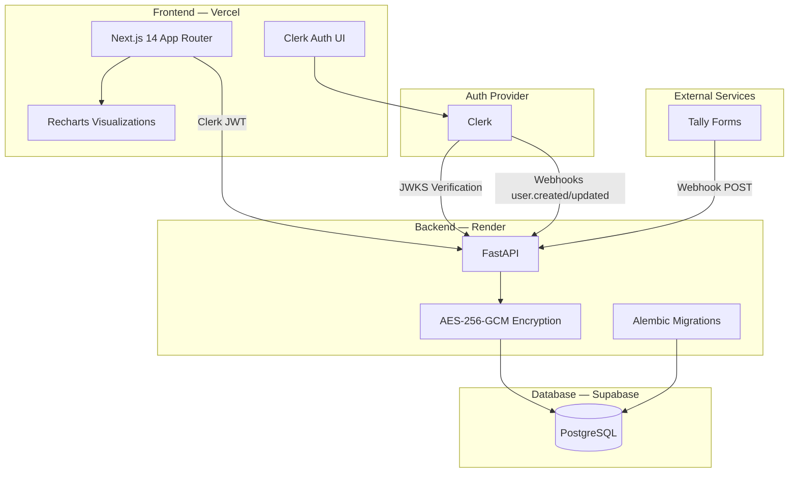
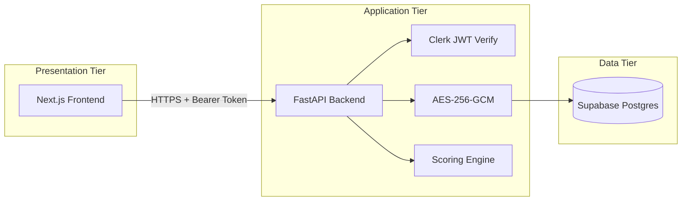
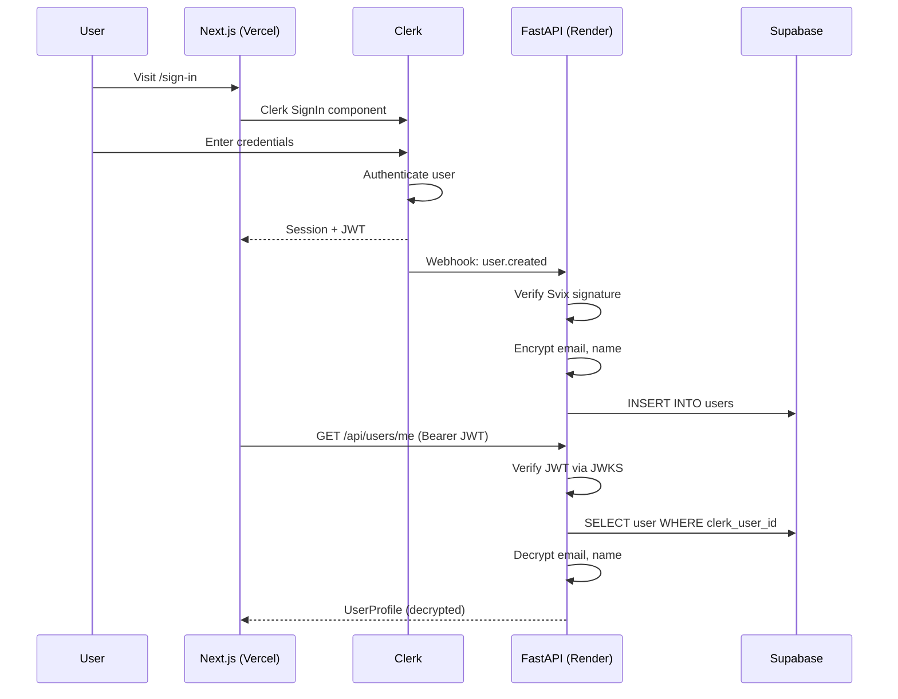
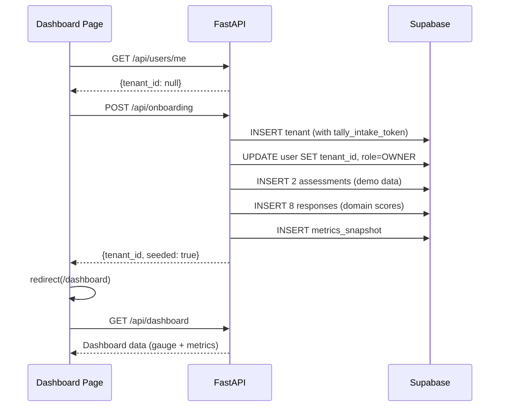
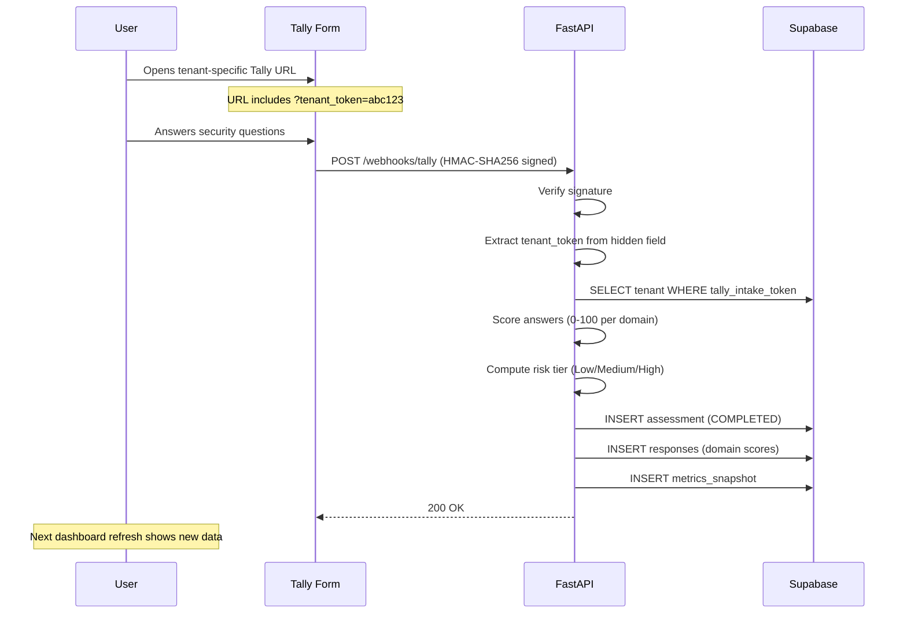
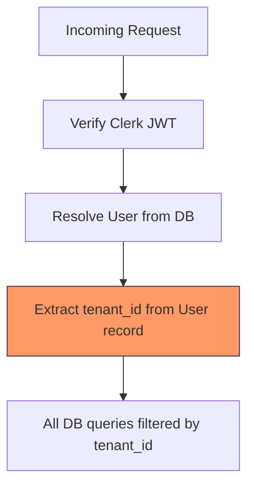
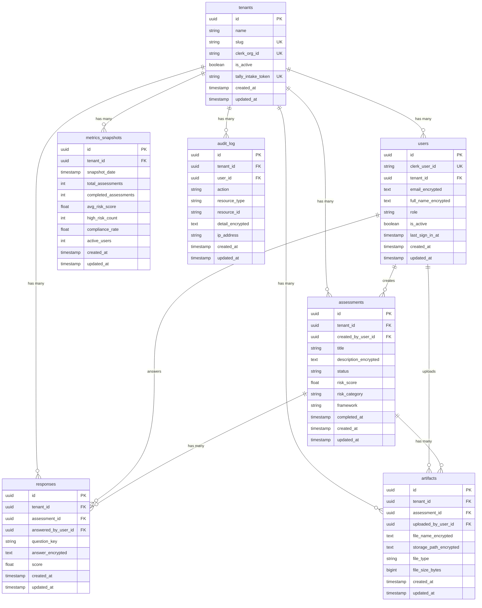
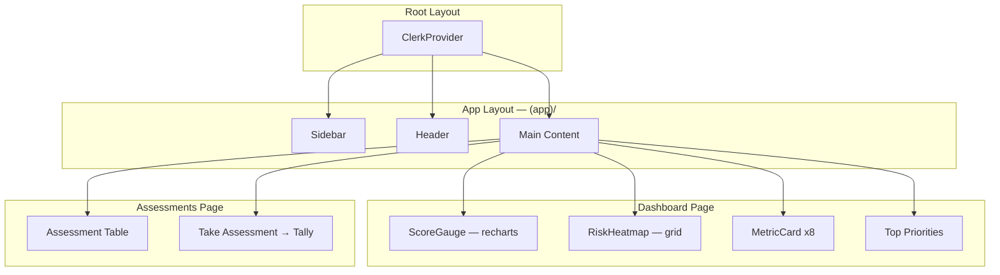
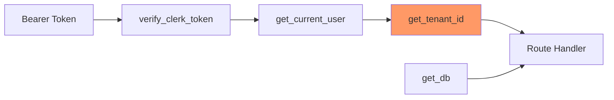

# CivicShieldAI

AI-powered cybersecurity risk assessment and compliance platform for municipal governments and small organizations.

CivicShieldAI enables organizations to evaluate their cybersecurity posture through structured assessments, visualize risk across security domains, and track improvement over time — all with field-level encryption and strict multi-tenant data isolation.

---

## Table of Contents

- [Architecture Overview](#architecture-overview)
- [System Design](#system-design)
- [Data Flow](#data-flow)
- [Security Architecture](#security-architecture)
- [Database Schema](#database-schema)
- [Frontend Architecture](#frontend-architecture)
- [Backend Architecture](#backend-architecture)
- [API Reference](#api-reference)
- [Assessment & Scoring](#assessment--scoring)
- [Deployment](#deployment)
- [Environment Variables](#environment-variables)
- [Project Structure](#project-structure)

---

## Architecture Overview



### Technology Stack

| Layer | Technology | Purpose |
|-------|-----------|---------|
| Frontend | Next.js 14 (App Router) | Server/client rendering, routing |
| UI Components | shadcn/ui + Tailwind CSS | Design system |
| Charts | Recharts | Gauge chart, heat map |
| Auth | Clerk | Sign-in/up, JWT tokens, user management |
| Backend | FastAPI (Python) | REST API, business logic |
| ORM | SQLAlchemy 2.0 (async) | Database access |
| Migrations | Alembic | Schema versioning |
| Database | Supabase (PostgreSQL) | Persistent storage |
| Encryption | cryptography (AES-256-GCM) | Field-level encryption |
| Assessment Intake | Tally | External questionnaire form |
| Frontend Hosting | Vercel | CDN, serverless |
| Backend Hosting | Render | Web service |

---

## System Design

### Three-Tier Architecture



**Key design decisions:**

1. **Separate backend** — The frontend never talks to Supabase directly. All data flows through FastAPI, enabling field-level encryption, tenant scoping, and audit logging at the application layer.

2. **Encryption at application level** — Sensitive fields (email, names, answers, file paths) are encrypted with AES-256-GCM before storage. Non-sensitive fields (scores, timestamps, statuses) remain plaintext for filtering and aggregation.

3. **Tenant scoping as middleware** — Every protected endpoint resolves `tenant_id` from the authenticated user's database record, never from the request body. This prevents cross-tenant data leaks by design.

4. **Async throughout** — asyncpg + SQLAlchemy async sessions for non-blocking database access.

---

## Data Flow

### User Authentication Flow



### Auto-Onboarding Flow



### Tally Assessment Flow



---

## Security Architecture

### Field-Level Encryption

7 fields across 5 tables are encrypted with AES-256-GCM:

| Table | Encrypted Field | Contains |
|-------|----------------|----------|
| `users` | `email_encrypted` | User email address |
| `users` | `full_name_encrypted` | User's full name |
| `assessments` | `description_encrypted` | Assessment description |
| `responses` | `answer_encrypted` | Free-text answer content |
| `artifacts` | `file_name_encrypted` | Uploaded file name |
| `artifacts` | `storage_path_encrypted` | Storage bucket path |
| `audit_log` | `detail_encrypted` | Change detail snapshot |

**Encryption format:** `base64(12-byte-nonce || ciphertext || 16-byte-GCM-tag)`

### Multi-Tenant Isolation



Every protected endpoint uses `Depends(get_tenant_id)` — the tenant is always derived server-side from the authenticated user, never accepted from the client.

### Role-Based Access Control

```
viewer (level 0) < admin (level 1) < owner (level 2)
```

The `require_role(minimum)` dependency enforces role hierarchy. Only users at or above the required level can access the endpoint.

### Webhook Security

| Webhook | Verification Method |
|---------|-------------------|
| Clerk (`/webhooks/clerk`) | Svix signature verification |
| Tally (`/webhooks/tally`) | HMAC-SHA256 with shared secret |

---

## Database Schema



### Migrations

| Version | Description |
|---------|-------------|
| `0001` | Initial schema — all 7 tables with indexes |
| `0002` | Add `tally_intake_token` to tenants |

---

## Frontend Architecture

### Route Structure

```
/                           Public landing page
/sign-in                    Clerk sign-in
/sign-up                    Clerk sign-up
/dashboard                  Risk score gauge + heat map + metric cards + priorities
/assessments                Assessment history table + Tally link
/debug/supabase             Health check / smoke test (public)
```

The `(app)` route group wraps `/dashboard` and `/assessments` with a shared layout (sidebar + header) without adding a URL prefix.

### Component Architecture



### Server vs Client Components

| Component | Type | Why |
|-----------|------|-----|
| Dashboard page | Server | Fetches data with `serverApi()`, no interactivity |
| Assessments page | Server | Same — server-side data fetching |
| Header | Server | Uses `currentUser()` from Clerk |
| Sidebar | Client | Needs `usePathname()` for active link |
| ScoreGauge | Client | Recharts requires browser APIs |
| RiskHeatmap | Client | Interactive color grid |
| MetricCard | Server | Pure presentation |

### API Clients

| Module | Context | Auth Method |
|--------|---------|-------------|
| `src/lib/api-client.ts` | Server Components, Route Handlers | `auth().getToken()` |
| `src/lib/api-client-browser.ts` | Client Components | `useAuth().getToken()` |

Both attach `Authorization: Bearer <clerk-jwt>` to every request to `NEXT_PUBLIC_API_URL`.

---

## Backend Architecture

### Module Structure

```
app/
├── main.py                 FastAPI app, CORS, router registration
├── config.py               pydantic-settings from .env
├── database.py             AsyncSession factory
├── models/                 SQLAlchemy ORM models (7 tables)
├── schemas/                Pydantic request/response schemas
├── routers/                FastAPI route handlers
│   ├── health.py           GET /health, /health/db
│   ├── webhooks.py         POST /webhooks/clerk, /webhooks/tally
│   ├── tenants.py          POST /api/tenants, GET /api/tenants/tally-link
│   ├── users.py            GET /api/users/me
│   ├── onboarding.py       POST /api/onboarding
│   ├── dashboard.py        GET /api/dashboard
│   └── assessments.py      GET /api/assessments
├── services/               Business logic
│   ├── encryption.py       AES-256-GCM encrypt/decrypt
│   ├── user_service.py     Clerk webhook user sync
│   ├── tenant_service.py   Tenant + owner creation
│   ├── onboarding_service.py  Idempotent onboarding + demo seed
│   ├── scoring.py          Tally answers → domain scores + risk tier
│   └── tally_service.py    Assessment/Response/Snapshot creation
├── middleware/             Auth & scoping
│   ├── clerk_auth.py       JWT verification via JWKS
│   ├── tenant_scope.py     get_current_user, get_tenant_id
│   └── rbac.py             require_role(minimum)
└── seeds/
    └── seed_dev.py         Dev data seeder
```

### Dependency Injection Chain



Every protected route depends on `get_tenant_id` which walks the chain: verify JWT → find user in DB → extract `user.tenant_id`.

---

## API Reference

See **[API.md](./API.md)** for complete endpoint documentation with request/response examples.

### Quick Reference

| Method | Path | Auth | Description |
|--------|------|------|-------------|
| GET | `/health` | None | Health check |
| GET | `/health/db` | None | Database connectivity |
| POST | `/webhooks/clerk` | Svix | Clerk user sync |
| POST | `/webhooks/tally` | HMAC-SHA256 | Tally form submission |
| POST | `/api/tenants` | Clerk JWT | Create tenant |
| GET | `/api/tenants/tally-link` | Clerk JWT | Get Tally form URL |
| GET | `/api/users/me` | Clerk JWT | Current user profile |
| POST | `/api/onboarding` | Clerk JWT | Auto-onboard user |
| GET | `/api/dashboard` | Clerk JWT | Dashboard metrics |
| GET | `/api/assessments` | Clerk JWT | Assessment list |

---

## Assessment & Scoring

### Scoring Model (Hybrid)

CivicShieldAI uses a hybrid scoring approach:

**Raw Point Scale (0–16)** — Simple yes/no scoring per control:

| Control | Points (Yes) |
|---------|-------------|
| MFA for Email | +2 |
| MFA for Remote Access | +2 |
| Daily Backup | +2 |
| Off-Site Backup | +3 |
| Endpoint Protection | +2 |
| Documented IR Plan | +2 |
| IR Drills (Quarterly/Bi-annual/Annual) | +3/+2/+1 |

**Domain Scores (0–100)** — Percentage scores per security domain:

| Domain Key | Domain Name |
|-----------|-------------|
| `mfa_coverage` | MFA Coverage |
| `backup_integrity` | Backup Integrity |
| `edr_av` | EDR / Antivirus |
| `patch_cadence` | Patch Cadence |
| `vulnerability_scan` | Vulnerability Scanning |
| `access_review` | Privileged Access Review |
| `incident_response` | Incident Response Plan |
| `security_training` | Security Training |

**Risk Tiers** (mapped from overall 0–100 score):

| Score Range | Tier | Dashboard Color |
|------------|------|----------------|
| >= 75 | Low Risk | Green |
| 50–74 | Medium Risk | Yellow |
| < 50 | High Risk | Red |

**Severity Thresholds** (per domain):

| Score | Severity | Color |
|-------|----------|-------|
| >= 80 | Low | Green |
| 65–79 | Medium | Yellow |
| 50–64 | High | Orange |
| < 50 | Critical | Red |

---

## Deployment

### Backend — Render

```yaml
services:
  - type: web
    name: civicshieldai-backend
    runtime: python
    buildCommand: pip install -r requirements.txt
    startCommand: alembic upgrade head && uvicorn app.main:app --host 0.0.0.0 --port $PORT
```

Migrations run at startup (not build time) because the build environment has no network access to Supabase.

### Frontend — Vercel

Deployed via Git push. Environment variables set in Vercel dashboard. No special build configuration needed — standard Next.js.

### External Services

| Service | Purpose | Configuration |
|---------|---------|--------------|
| Clerk | Authentication | Dashboard: webhook → `/webhooks/clerk` |
| Tally | Assessment intake | Hidden field `tenant_token`, webhook → `/webhooks/tally` |
| Supabase | PostgreSQL | Connection string with `+asyncpg` scheme |

---

## Environment Variables

### Backend (`civicshieldai-backend/.env`)

| Variable | Required | Description |
|----------|----------|-------------|
| `DATABASE_URL` | Yes | Supabase connection string (`postgresql+asyncpg://...`) |
| `ENCRYPTION_KEY` | Yes | 64 hex characters (32 bytes for AES-256-GCM) |
| `CLERK_PUBLISHABLE_KEY` | No | Clerk publishable key |
| `CLERK_SECRET_KEY` | No | Clerk secret key |
| `CLERK_WEBHOOK_SECRET` | Yes | Svix signing secret from Clerk webhooks |
| `CLERK_JWKS_URL` | No | Clerk JWKS endpoint (auto-derived if not set) |
| `FRONTEND_URL` | No | Primary frontend URL for CORS (default: `http://localhost:3000`) |
| `FRONTEND_URLS` | No | Comma-separated additional CORS origins |
| `TALLY_WEBHOOK_SIGNING_SECRET` | No | HMAC-SHA256 secret from Tally webhooks |
| `ENVIRONMENT` | No | `development` or `production` (default: `development`) |

### Frontend (`civicshieldai-frontend/.env.local`)

| Variable | Required | Description |
|----------|----------|-------------|
| `NEXT_PUBLIC_CLERK_PUBLISHABLE_KEY` | Yes | Clerk publishable key |
| `CLERK_SECRET_KEY` | Yes | Clerk secret key (server-side only) |
| `NEXT_PUBLIC_CLERK_SIGN_IN_URL` | Yes | `/sign-in` |
| `NEXT_PUBLIC_CLERK_SIGN_UP_URL` | Yes | `/sign-up` |
| `NEXT_PUBLIC_CLERK_AFTER_SIGN_IN_URL` | Yes | `/dashboard` |
| `NEXT_PUBLIC_CLERK_AFTER_SIGN_UP_URL` | Yes | `/dashboard` |
| `NEXT_PUBLIC_API_URL` | Yes | FastAPI base URL (e.g., `http://localhost:8000`) |

---

## Project Structure

```
civicshieldai/
├── README.md                          # This file
├── API.md                             # API endpoint documentation
├── ONBOARDING.md                      # Developer onboarding guide
│
├── civicshieldai-backend/             # FastAPI backend (Render)
│   ├── app/
│   │   ├── main.py                    # App entry point, CORS, routers
│   │   ├── config.py                  # pydantic-settings
│   │   ├── database.py                # Async engine + session factory
│   │   ├── models/                    # SQLAlchemy models (7 tables)
│   │   ├── schemas/                   # Pydantic schemas
│   │   ├── routers/                   # Route handlers
│   │   ├── services/                  # Business logic
│   │   ├── middleware/                # Auth, tenant scoping, RBAC
│   │   └── seeds/                     # Dev data seeder
│   ├── alembic/                       # Database migrations
│   │   ├── env.py
│   │   └── versions/
│   │       ├── 0001_initial_schema.py
│   │       └── 0002_add_tally_intake_token.py
│   ├── requirements.txt
│   ├── render.yaml
│   └── alembic.ini
│
├── civicshieldai-frontend/            # Next.js frontend (Vercel)
│   ├── src/
│   │   ├── app/                       # App Router pages
│   │   │   ├── (app)/                 # Protected route group
│   │   │   │   ├── dashboard/
│   │   │   │   └── assessments/
│   │   │   ├── sign-in/
│   │   │   ├── sign-up/
│   │   │   └── debug/
│   │   ├── components/                # React components
│   │   │   ├── layout/                # Sidebar, Header
│   │   │   ├── dashboard/             # ScoreGauge, RiskHeatmap, MetricCard
│   │   │   └── ui/                    # shadcn/ui primitives
│   │   ├── lib/                       # API clients, utilities
│   │   ├── types/                     # TypeScript interfaces
│   │   └── middleware.ts              # Clerk route protection
│   ├── package.json
│   ├── tailwind.config.ts
│   └── CLAUDE.md
│
└── message.txt, message (1).txt       # Original requirement docs
```
